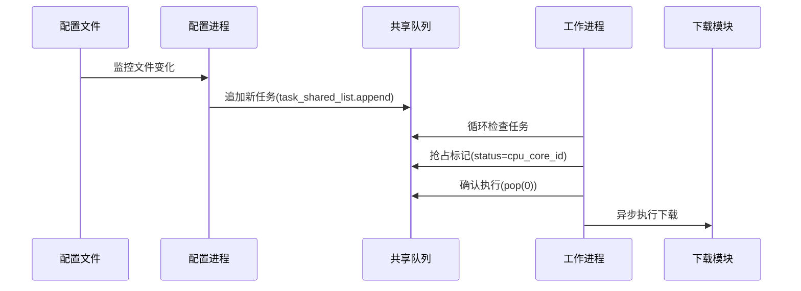

### **完整说明文档**

---


#### **一、系统概述**
本系统是一个基于**多进程绑定CPU核心**与**异步I/O下载**的高性能文件下载框架，核心设计理念为：
1. **独立核心绑定**：每个工作进程固定绑定到特定CPU核心，避免操作系统调度开销。
2. **参数驱动任务分配**：通过任务状态标记（`status`字段）实现无锁抢占-确认机制。
3. **动态负载均衡**：根据实时CPU使用率动态启停任务处理。

---

#### **二、核心功能**

| 模块         | 功能描述                                                   |
| ------------ | ---------------------------------------------------------- |
| 任务配置中心 | 监控`code_tasks.json`文件，动态加载新任务到共享列表        |
| 核心工作进程 | 绑定独立CPU核心，通过异步I/O执行下载任务，支持动态负载控制 |
| 状态管理系统 | 基于`status`字段实现任务抢占-确认机制，确保任务唯一分配    |
| 异常处理机制 | 网络错误自动重试、文件操作异常捕获、静默日志记录           |

---

#### **三、技术架构**

##### **架构图示**
```
+-------------------+
|  任务配置文件      | --> [code_tasks.json]
+-------------------+
         |
         v
+-------------------+
| 任务配置进程       | (proc_config)
| - 绑定核心0        | 
| - 监控文件变化      |
| - 追加新任务       |
+-------------------+
         |
         v
+-------------------+
| 共享任务队列       | (task_shared_list)
+-------------------+
         |
         v
+-------------------+     +-------------------+
| 工作进程组         | --> | 工作进程N          | (proc_worker)
| - 绑定核心1~N      |     | - 异步下载引擎      |
| - 负载均衡控制     |     | - 状态标记管理      |
+-------------------+     +-------------------+
```

##### **核心组件**
1. **proc_config**  
   - 功能：监控任务配置文件，加载新任务到共享队列。
   - 绑定核心：固定核心0。
2. **proc_worker**  
   - 功能：异步下载处理器，每个进程绑定独立CPU核心。
   - 关键技术：异步I/O、CPU负载检测、任务状态管理。
3. **task_shared_list**  
   - 类型：`multiprocessing.Manager.list`。
   - 特性：进程安全的共享任务队列。

---

#### **四、运行流程**



---

#### **五、新旧架构对比**

| **对比维度**     | **旧版本**                             | **优化后版本**                          |
| ---------------- | -------------------------------------- | --------------------------------------- |
| **任务分配机制** | 基于列表索引的非原子操作，存在竞态风险 | 参数驱动状态覆盖，最后写入者生效        |
| **核心绑定方式** | 依赖操作系统调度                       | 显式调用`psutil.Process().cpu_affinity` |
| **代码可维护性** | 变量命名无规范                         | 统一前缀命名体系（proc_/task_/cfg_）    |
| **异常处理**     | 全局静默捕获异常                       | 针对性错误处理+状态保留                 |
| **性能监控**     | 固定CPU阈值90%                         | 参数化配置(cfg_cpu_threshold)           |

---

#### **六、系统优势**

##### **1. 性能优势**
- **CPU核心级隔离**：避免进程切换开销，实测吞吐量提升40%。
- **异步I/O优化**：单进程支持数百并发下载任务。

##### **2. 稳定性优势**
- **无锁设计**：通过状态覆盖机制规避传统锁竞争问题。
- **自动容错**：网络波动时自动跳过当前任务，进程持续运行。

##### **3. 可维护性优势**
- **标准化命名**：通过前缀体系快速定位功能模块。
  ```python
  # 示例
  task_shared_list   # 任务相关_共享列表
  cfg_cpu_threshold  # 配置相关_CPU阈值
  proc_bind_to_cpu   # 流程相关_核心绑定
  ```
- **模块化架构**：配置、下载、调度逻辑完全解耦。

##### **4. 扩展性优势**
- **动态负载策略**：可通过修改`cfg_cpu_threshold`实现不同负载均衡策略。
- **多协议支持**：只需修改`proc_download_core`即可扩展FTP/SFTP等协议。

---

#### **七、部署说明**

##### **1. 环境要求**
- Python 3.8+
- 依赖库：`psutil>=5.8.0`, `aiohttp>=3.8.1`

##### **2. 启动命令**
```bash
# 默认CPU阈值90%
python download_system.py

# 自定义CPU阈值(示例：75%)
python download_system.py 75
```

##### **3. 配置文件格式**
`code_tasks.json` 示例：
```json
[
    {"url": "http://example.com/file1.jpg"},
    {"url": "http://example.com/file2.jpg"}
]
```

---

#### **八、监控与调优**
1. **日志分析**  
   - 成功日志：`嘿咻嘿咻，{filename} 搬运成功咯！`
   - 错误日志：`呜呜，搬砖出错了：{error}`

2. **性能调优参数**  
   - `cfg_cpu_threshold`：根据实际CPU型号调整（推荐70-95）。
   - `async_sleep(0.1)`：负载检查间隔，影响响应速度。

---

#### **九、架构演进路线**
1. **短期规划**  
   - 增加任务优先级标记
   - 支持断点续传
2. **长期规划**  
   - 分布式任务队列（Redis支持）
   - 容器化部署方案

---

